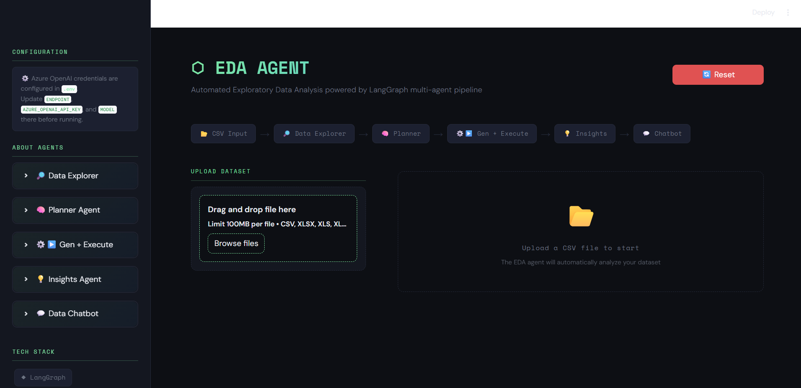
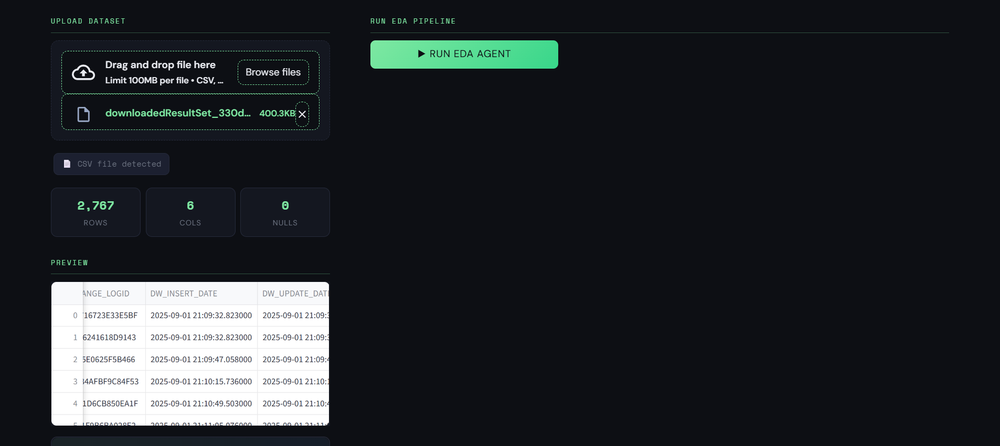
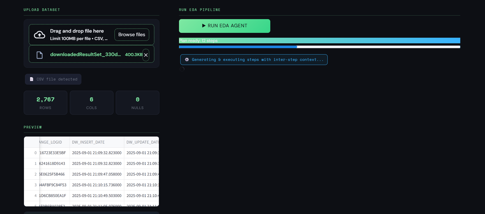
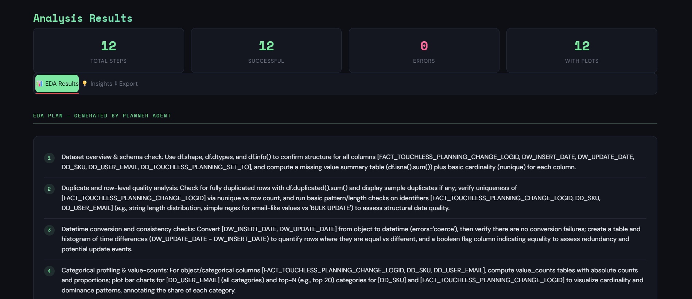
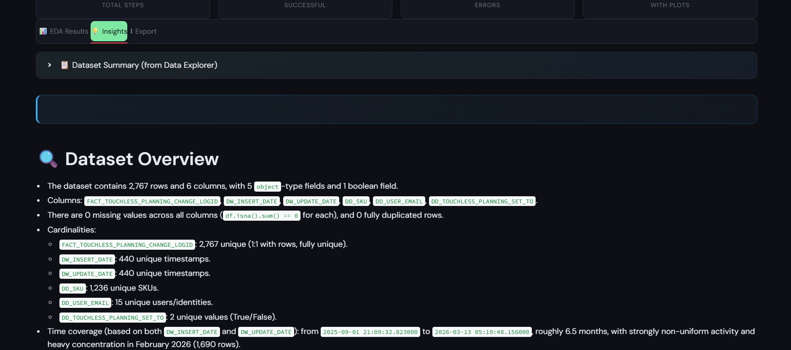
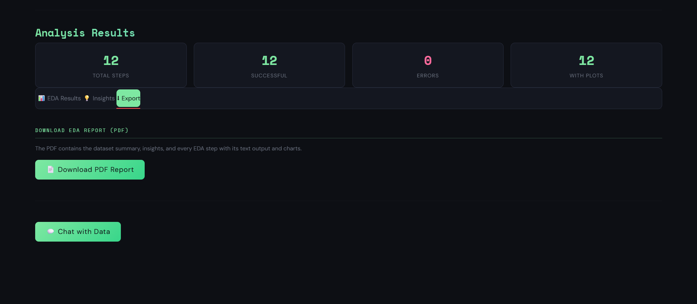
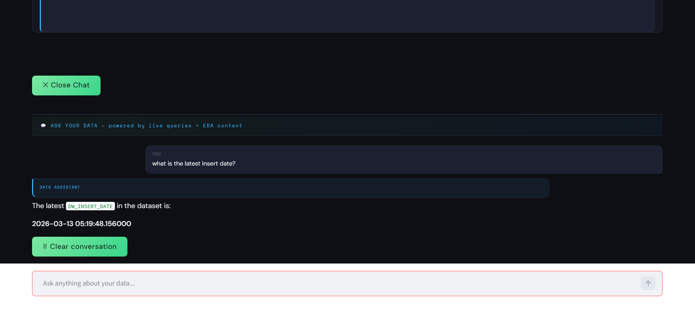

# ⬡ EDA Agent

> **Automated Exploratory Data Analysis powered by a LangGraph multi-agent pipeline and Azure OpenAI.**

Upload any tabular dataset and the agent autonomously explores it, builds a custom EDA plan, generates and executes Python analysis code, produces charts and statistics, writes an executive insights report, exports to PDF — then lets you interrogate your data through a live chatbot.

---



---

## Features

- **Zero-configuration EDA** — upload a file, click Run, get a full analysis
- **Multi-agent pipeline** — 4 specialized agents work in sequence, each building on the previous
- **Dynamic data exploration** — Data Explorer uses tool-calling to run pandas queries autonomously (no hardcoded analysis)
- **Self-healing code execution** — failed steps are automatically regenerated with error context and retried (up to 3 attempts)
- **Live data chatbot** — ask questions in plain English; the chatbot runs fresh pandas queries on your data combined with full EDA context
- **One-click PDF export** — download a full report with cover page, charts, insights, and step-by-step outputs

---

## Pipeline Architecture

```
📂 CSV / Excel / TSV Input
    ↓
🔎 Data Explorer        — Tool-calling agent. Runs pandas queries dynamically to understand
                          every column. Produces a rich dataset summary.
    ↓
🧠 Planner              — Reads the summary and generates a 8–12 step column-specific EDA plan.
                          Ensures every column is covered.
    ↓
⚙️▶️ Code Gen + Execute — For each step: generates Python code → executes it → extracts findings
                          → passes findings to the next step. Self-healing retries on failure.
    ↓
💡 Insights Agent       — Synthesizes all results into a structured executive report with
                          anomalies, correlations, feature engineering, and next steps.
    ↓
💬 Data Chatbot         — Answers questions by combining full EDA context with live pandas
                          queries executed on-demand via the query_dataframe tool.
```

---

## Demo













---

## Getting Started

### Prerequisites

- Python **3.10+**
- An **Azure OpenAI** account with a deployed model (e.g. `gpt-4o`, `gpt-5.1`)
- Access to the Azure OpenAI Responses API (`client.responses.create`)

---

### Installation

```bash
# 1. Clone the repository
git clone https://github.com/chinmaymalkar10/EDA-Agent.git
cd eda-agent

# 2. Create and activate a virtual environment
python -m venv venv
source venv/bin/activate        # macOS / Linux
venv\Scripts\activate           # Windows

# 3. Install dependencies
pip install -r requirements.txt
```

---

### Configuration

Create a `.env` file in the project root (same folder as `App.py`):

```env
AZURE_OPENAI_API_KEY=your_api_key_here
ENDPOINT=your_endpoint
API_VERSION=api_version
MODEL=model_name
```

| Variable | Description |
|---|---|
| `AZURE_OPENAI_API_KEY` | Your Azure OpenAI API key |
| `ENDPOINT` | Your Azure OpenAI endpoint URL |
| `API_VERSION` | API version — must support the Responses API |
| `MODEL` | Deployment name of your model |

> **Important:** Never commit `.env` to version control — add it to `.gitignore`.

---

### Running the App

```bash
streamlit run App.py
```

The app will open in your browser at `http://localhost:8501`.

---

## Project Structure

```
eda-agent/
│
├── App.py                  # Streamlit UI — rendering, pipeline orchestration, PDF export
├── eda_agent.py            # Agent logic — all 4 agents, LangGraph graph, chatbot
├── config.py               # Centralized configuration — all tunable values
├── style.css               # Dark-mode UI styling
├── requirements.txt        # Python dependencies
├── .env                    # Azure OpenAI credentials (create this — not committed)
│
├── .streamlit/
│   └── config.toml         # Auto-created — Streamlit server config (upload size limit)
│
├── eda_outputs/            # Auto-created — plots generated during a run
├── logs.log                # Text log — per-call token stats, optional full LLM logs
├── logs.jsonl              # Structured JSON event log — every agent event timestamped
└── errors.jsonl            # Structured error log — exceptions with full tracebacks
```

---

## Supported File Formats

| Format | Extensions | Engine |
|---|---|---|
| CSV | `.csv` | pandas |
| Excel | `.xlsx`, `.xlsm`, `.xlsb` | openpyxl |
| Legacy Excel | `.xls` | xlrd |
| OpenDocument | `.ods`, `.odf`, `.odt` | odfpy |
| Tab-separated | `.tsv`, `.txt` | pandas (sep=`\t`) |

Maximum file size: **100 MB** (configurable in `config.py`). Auto-detection: if the extension is unrecognized, the app tries CSV first, then falls back to Excel.

---

## How It Works

**Data Explorer** — Receives only a minimal schema. Uses a `query_dataframe` tool to run pandas expressions autonomously, covering distributions, correlations, missingness, outliers, time-series patterns, and statistical tests. Outputs a comprehensive dataset summary.

**Planner** — Reads the explorer's summary and generates a structured 8–12 step EDA plan. Every column must appear in at least one step. Falls back to a hardcoded plan if JSON parsing fails.

**Code Gen + Execute** — For each step: generates Python code using findings from all previous steps → executes in an isolated context → captures stdout and plots → on failure, regenerates with error context and retries (up to 3 attempts) → extracts a finding and passes it to the next step.

**Insights Agent** — Synthesizes all results into a markdown executive report: overview, column summaries, statistical findings, data quality issues, correlations, anomalies, feature engineering recommendations, and next steps.

**Data Chatbot** — Combines full EDA context with live `query_dataframe` tool calls to answer questions with exact numbers. Supports up to 8 tool-calling rounds per question.

---

## Logging & Error Handling

| File | Format | Contents |
|---|---|---|
| `logs.log` | Plain text | Per-call token stats, optional full LLM prompt/response logs |
| `logs.jsonl` | JSON Lines | Structured events: agent starts, LLM calls, step executions, warnings |
| `errors.jsonl` | JSON Lines | Exceptions with timestamp, context, type, message, full traceback |

```jsonl
{"ts": "2026-03-26T12:00:00", "event": "llm_call", "agent": "Data Explorer", "input_tokens": 1667, "output_tokens": 125, ...}
{"timestamp": "2026-03-26T12:00:10", "context": "run_pipeline", "type": "AuthenticationError", "message": "...", "traceback": "..."}
```

Errors are shown to users as clean, actionable messages. Full tracebacks are logged to `errors.jsonl` and available behind a collapsed "Technical details" expander for pipeline errors.

---

## Tech Stack

| Component | Library |
|---|---|
| Agent orchestration | [LangGraph](https://github.com/langchain-ai/langgraph) |
| LLM client | [Azure OpenAI](https://learn.microsoft.com/en-us/azure/ai-services/openai/) via `openai` SDK |
| Data manipulation | [Pandas](https://pandas.pydata.org/), [NumPy](https://numpy.org/) |
| Visualization | [Matplotlib](https://matplotlib.org/), [Seaborn](https://seaborn.pydata.org/) |
| Statistical tests | [SciPy](https://scipy.org/) |
| Anomaly detection | [scikit-learn](https://scikit-learn.org/) (Isolation Forest) |
| UI | [Streamlit](https://streamlit.io/) |
| PDF export | [ReportLab](https://www.reportlab.com/) |
| Excel support | [openpyxl](https://openpyxl.readthedocs.io/), [xlrd](https://xlrd.readthedocs.io/), [odfpy](https://github.com/eea/odfpy) |
| Environment config | [python-dotenv](https://github.com/theskumar/python-dotenv) |
